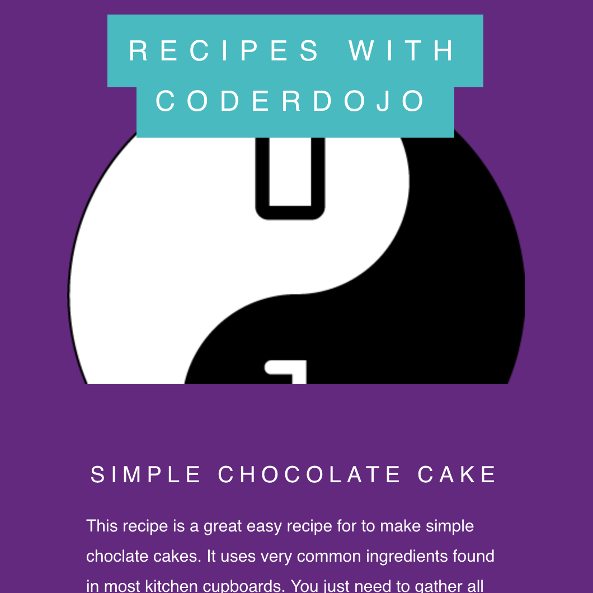

## Introduction

In this project, you will learn to use a cool website scrolling technique called 'parallax scroll' to create a web page for a cake recipe.

--- no-print ---
Scroll through the web page to see the parallax scroll effect in action.

<iframe src="https://trinket.io/embed/html/4b83d6865b?outputOnly=true&start=result" width="600" height="505" frameborder="0" marginwidth="0" marginheight="0" allowfullscreen> </iframe>

--- /no-print ---

--- print-only ---

--- /print-only ---

--- collapse ---
---
title: What you will learn
---
+ How to use CSS classes
+ How to use the `background-image` and `background-attachment: fixed` CSS properties
+ How to use the CSS `@media` rule for responsive web design

--- /collapse ---

--- collapse ---
---
title: What you will need
---
### Hardware
+ A computer connected to the internet

--- /collapse ---

--- collapse ---
---
title: Additional notes for educators
---
--- no-print ---
If you need to print this project, please use the [printer-friendly version](https://projects.raspberrypi.org/en/projects/sweet-scroll/print).
--- /no-print ---

[Here is a link to the resources for this project](https://github.com/raspberrypilearning/sweet-scroll/tree/draft/en/resources){:target="_blank"}.
--- /collapse ---
