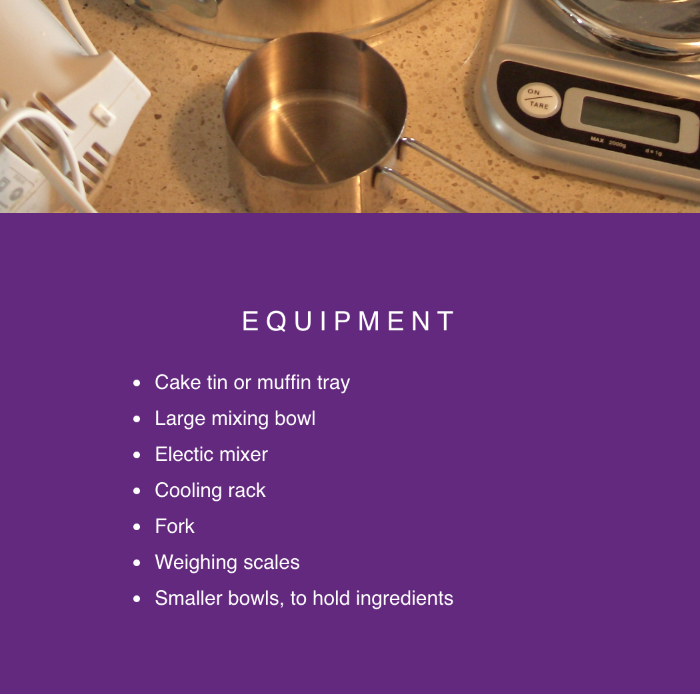

## Get started

--- task ---

Open the starter project.

+ I'm using Trinket online

Open the 'Sweet scroll' starter trinket at [dojo.soy/SweetScrollStart](http://dojo.soy/SweetScrollStart){:target="_blank"}.

+ I'm using an offline editor

Download the 'Sweet scroll' starter files from [dojo.soy/SweetScrollStart](http://dojo.soy/SweetScrollStart) and open them in your editor. If you are unsure how to work offline on your web page, check out [our guide about writing HTML and CSS code offline](https://codeclubprojects.org/en-GB/resources/webdev-working-offline/){:target="_blank"}.

--- /task ---

In the `index.html` file, there are some pieces of content in `div` elements. 

The CoderDojo logo is displayed using an empty `div` with the CSS property ```background-image```.

--- task ---

In the `index.html` file, create another `div` with an image of some kitchen equipment.

Add a `div` element to the bottom of your page, **inside** the `<html>` tags. Give the `div` a helpful class name, e.g. `kitchen-equipment`.

```html
  <div class="kitchen-equipment">

  </div>
  ```

--- /task ---

--- task ---

Go to the ```style.css``` file, and add a CSS rule-set for your new class, including the link to the image you want to display.
```css
  .kitchen-equipment {
    background-image: url("utensils.JPG");
  }
```
--- /task ---

--- task ---

+ In the CSS file, add the new class name to the list of selectors for the rule-set that is already there.
```css
  .cd-logo, .kitchen-equipment {
  position: relative;
  background-position: center;
  background-repeat: no-repeat;
  background-color: #642580;
  background-size: cover;
  min-height: 100%;
}
```
Now, all these property and value pairs apply to your new background image.

Scroll through your web page, and you should now see the new image.
--- /task ---

--- task ---

Add more `div` elements with pictures or text. 

The example below shows you how to add:
+ A list of the equipment for baking a cake
+ A picture of the cake ingredients

--- hints ---
--- hint ---
To add a section with text, include any HTML tags you want inside a `div`. Then, add the appropriate CSS rules. The starter project already includes `<p>` and `<h3>` tags in the 'simple chocolate cake' section. The example section below uses `<ul>` and `<li>` tags. Add the class name `textSection` to your new section to apply the same CSS rules that apply to the 'simple chocolate cake' section.

```html
<div class="textSection">
    <h3>EQUIPMENT</h3>
    <ul>
     <li>Cake tin or muffin tray</li>
     <li>Large mixing bowl</li>
     <li>Electric mixer</li>
     <li>Cooling rack</li>
     <li>Fork</li>
     <li>Weighing scales</li>
     <li>Smaller bowls, to hold ingredients</li>
    </ul>
  </div>
```
--- /hint ---
--- hint ---
To add a section with an image, create a `div` element and give it a class name. Then use the CSS property `background-image` to add an image to the new`div` element.

```html
  <div class="cake-ingredients">

  </div>
  ```
--- /hint ---
--- hint ---
Here is the CSS code to assign a background image to your new `div`:

```css
  .cake-ingredients {
    background-image: url("ingredients.jpg");
  }
```

Add your new `div` element's class name to the list of selectors for the following CSS rule.

```css
  .cd-logo, .kitchen-equipment, .cake-ingredients {
  position: relative;
  background-position: center;
  background-repeat: no-repeat;
  background-color: #642580;
  background-size: cover;
  min-height: 100%;
}
```
--- /hint ---
--- /hints ---

--- /task ---


