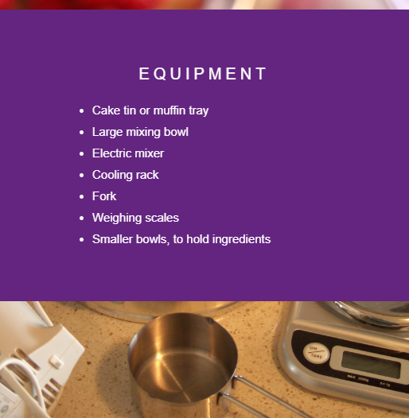

## Getting started

--- task ---

Open the starter project.

+ I'm using Trinket online

Open the Sweet scroll starter trinket at [dojo.soy/SweetScrollStart](http://dojo.soy/SweetScrollStart){:target="_blank"}

+ I'm using an offline editor

Download the Sweet scroll starter files from the dojo.soy link above and open them in your editor. For help writing HTML and CSS offline, visit: [https://codeclubprojects.org/en-GB/resources/webdev-working-offline/](https://codeclubprojects.org/en-GB/resources/webdev-working-offline/){:target="_blank"}

--- /task ---

In the `index.html` file, you will see some pieces of content in `div` elements. 

The CoderDojo logo is displayed using an empty `div` with the CSS property ```background-image```.

--- task ---

You will now add another `div` with an image of some kitchen equipment.

Add a ```div``` element to the bottom of your page (keep it inside the ```<html>``` tags) and use a helpful class name, e.g., ```kitchen-equipment```.

```html
  <div class="kitchen-equipment">

  </div>
  ```

--- /task ---

--- task ---

+ Now, in the ```style.css``` file, add a new CSS rule-set for your class name that includes the link to the image you would like to display.
```css
  .kitchen-equipment {
    background-image: url("utensils.JPG");
  }
```
--- /task ---

--- task ---

+ Finally, add your class name to the list of selectors for the second rule-set in your CSS file. This will apply all these property and value pairs to your new background image.
```css
  .cd-logo, .kitchen-equipment {
  position: relative;
  background-position: center;
  background-repeat: no-repeat;
  background-color: #642580;
  background-size: cover;
  min-height: 100%;
}
```

You should now be able to see the new image if you scroll through your webpage.
--- /task ---

--- task ---

Add more divs with pictures or text. 

In the below example, you will add a list of the equipment we need to bake a cake, and a picture of the ingredients.

--- hints ---
--- hint ---
To add a section with text, include any html you want inside a `div`. Then, add the appropriate CSS. `<p>` and `<h3>` tags were used for the simple chocolate cake section. This time, we will use `<ul>` and `<li>` tags. You can use the class name `textSection` to keep the same CSS rules as the simple chocolate cake section.

```html
<div class="textSection">
    <h3>EQUIPMENT</h3>
    <ul>
     <li>Cake tin or muffin tray</li>
     <li>Large mixing bowl</li>
     <li>Electric mixer</li>
     <li>Cooling rack</li>
     <li>Fork</li>
     <li>Weighing scales</li>
     <li>Smaller bowls, to hold ingredients</li>
    </ul>
  </div>
```
--- /hint ---
--- hint ---
To add a section with an image, create a `div` element and give it an id. Then use the CSS property `background-image` to give it an image.

```html
  <div class="cake-ingredients">

  </div>
  ```
--- /hint ---
--- hint ---
Here is the CSS code to assign a background image to your new `div`:

```css
  .cake-ingredients {
    background-image: url("ingredients.jpg");
  }
```

Remember to add your new div id to the list of selectors for the following rule.

```css
  .cd-logo, .kitchen-equipment, .cake-ingredients {
  position: relative;
  background-position: center;
  background-repeat: no-repeat;
  background-color: #642580;
  background-size: cover;
  min-height: 100%;
}
```
--- /hint ---
--- /hints ---

--- /task ---


