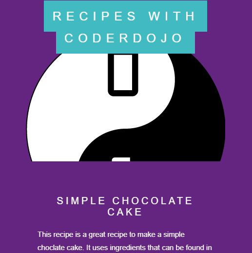

## परिचय

इस परियोजना में, आप केक विधि का एक वेब पृष्ठ(पेज) बनाने के लिए 'parallax scroll'('लंबन स्क्रॉल') नामक एक मजेदार वेबसाइट स्क्रॉलिंग तकनीक का उपयोग करना सीखेंगे।

--- no-print ---

लंबन स्क्रॉल(Parallax scroll) के प्रभाव को देखने के लिए वेब पृष्ठ(पेज) को स्क्रॉल करें। 
<iframe src="https://trinket.io/embed/html/4b83d6865b?outputOnly=true&start=result" width="600" height="505" frameborder="0" marginwidth="0" marginheight="0" allowfullscreen mark="crwd-mark"> </iframe>

--- /no-print ---

--- print-only ---

--- /print-only ---

--- collapse ---
---
title: आप क्या सीखेंगे
---

+ CSS क्लास का उपयोग कैसे करें
+ CSS के गुण(properties) `background-image` और `background-attachment: fixed` का उपयोग कैसे करें
+ उत्तरदायी(responsive) वेब डिज़ाइन के लिए CSS `@media` नियम का उपयोग कैसे करें

--- /collapse ---

--- collapse ---
---
title: आपको किन चीज़ों की आवश्यकता होगी
---

### हार्डवेयर
+ एक कंप्यूटर जो इंटरनेट से जुड़ा हुआ है

--- /collapse ---

--- collapse ---
---
title: शिक्षकों के लिए अतिरिक्त टिप्पणियाँ
---

--- no-print ---

यदि आप इस प्रोजेक्ट को प्रिंट करना चाहते हैं, तो कृपया [प्रिंटर अनुकूल वर्ज़न](https://projects.raspberrypi.org/hi-IN/projects/sweet-scroll/print) का उपयोग करें।

--- /no-print ---

[यहां इस परियोजना के लिए संसाधनों की एक शृंखला(link) है](https://github.com/raspberrypilearning/sweet-scroll/tree/draft/hi-IN/resources){:target="_blank"}।

--- /collapse ---
