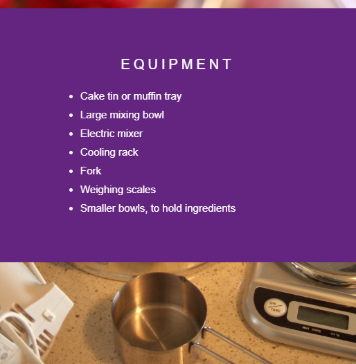

## शुरू करें

--- task ---

प्रारंभक परियोजना(project) खोलें।

+ मैं ट्रिंकेट(Trinket) ऑनलाइन का उपयोग कर रहा हूं

[dojo.soy/SweetScrollStart](http://dojo.soy/SweetScrollStart){:target="_blank"} पर 'स्वीट स्क्रॉल' प्रारंभक ट्रिंकेट ('Sweet scroll' starter trinket) खोलें।

+ मैं एक ऑफ़लाइन संपादक(editor) का उपयोग कर रहा हूँ

[dojo.soy/SweetScrollStart](http://dojo.soy/SweetScrollStart) से 'स्वीट स्क्रॉल'(Sweet scroll) स्टार्टर फाइलें डाउनलोड करें और उन्हें अपने एडीटर में खोलें। यदि आप अनिश्चित हैं कि अपने वेब पेज(वेब पृष्ठ) पर ऑफ़लाइन कैसे काम करें, तो [HTML और CSS कोड ऑफ़लाइन लिखने के बारे में हमारी गाइड](https://codeclubprojects.org/en-GB/resources/webdev-working-offline/){:target="_blank"} देखें।

--- /task ---

`index.html` फ़ाइल में, `div` तत्वों(elements) में सामग्री(content) के कुछ टुकड़े हैं।

CoderDojo लोगो(logo) को रिक्त `div` के साथ सीएसएस प्रॉपर्टी(CSS property) `background-image` का उपयोग करके प्रदर्शित किया गया है।

--- task ---

`index.html` फ़ाइल में, एक और `div` कुछ रसोई उपकरणों के चित्र के साथ बनाएँ ।

`<html>` टैग के **अंदर** अपने पृष्ठ के नीचे एक `div` तत्व(element) जोड़े। `div` को एक सहायक क्लास नाम दें, जैसे `kitchen-equipment`।

```html
  <div class="kitchen-equipment">

  </div>
  ```

--- /task ---

--- task ---

`style.css` फ़ाइल पर जाएं, और अपनी नई क्लास के लिए एक CSS नियम-सेट(rule-set) जोड़ें, जिसमें उस चित्र का लिंक शामिल हो जिसे आप प्रदर्शित करना चाहते हैं।
```css
  .kitchen-equipment {
    background-image: url("utensils.JPG");
  }
```

--- /task ---

--- task ---

+ CSS फ़ाइल में, नियम-सेट के लिए चयनकर्ताओं(selectors) की सूची में नया क्लास नाम जोड़ें जो पहले से ही वहां है।
```css
  .cd-logo, .kitchen-equipment {
  position: relative;
  background-position: center;
  background-repeat: no-repeat;
  background-color: #642580;
  background-size: cover;
  min-height: 100%;
}
```
अब, ये सभी प्रॉपर्टी और मूल्य(values) आपकी नई पृष्ठभूमि छवि(background image) पर लागू करें।

अपने वेब पेज(पृष्ठ) पर स्क्रॉल करे, अब आपको नया चित्र दिखना चाहिए।

--- /task ---

--- task ---

चित्र या पाठ(text) के साथ और `div` तत्व(elements) जोड़ें।

नीचे दिया गया उदाहरण आपको दिखाता है:
+ केक पकाने के लिए उपकरणों की एक सूची
+ केक सामग्री की एक तस्वीर

--- hints --- --- hint ---

पाठ(text) के साथ एक अनुभाग जोड़ने के लिए, किसी भी HTML टैग को शामिल करें जिसे आप `div` के अंदर चाहते हैं। फिर, उपयुक्त CSS नियम जोड़ें। स्टार्टर प्रोजेक्ट(starter project) में पहले से ही 'सरल चॉकलेट केक'('simple chocolate cake') सेक्शन में `<p>` and `<h3>` टैग शामिल हैं। नीचे दिया गया उदाहरण, `<ul>` और `<li>` टैग का उपयोग करता है। अपने नए अनुभाग(section) में समान CSS नियम लागू करने के लिए, क्लास का नाम `textSection` जोड़ें, जो 'सरल चॉकलेट केक' अनुभाग पर लागू हैं।

```html
<div class="textSection">
    <h3>EQUIPMENT</h3>
    <ul>
     <li>Cake tin or muffin tray</li>
     <li>Large mixing bowl</li>
     <li>Electric mixer</li>
     <li>Cooling rack</li>
     <li>Fork</li>
     <li>Weighing scales</li>
     <li>Smaller bowls, to hold ingredients</li>
    </ul>
  </div>
```

--- /hint --- --- hint ---

चित्र के साथ अनुभाग(section) जोड़ने के लिए एक `div` तत्व(element) बनाएं और इसे एक क्लास का नाम दें। फिर नए `div` तत्व में जोड़ने के लिए CSS संपत्ति(property) `background-image` का उपयोग करें।

```html
  <div class="cake-ingredients">

  </div>
  ```

--- /hint --- --- hint ---

आपके नए `div` में परिप्रेक्ष्य(background) चित्र असाइन करने के लिए यहाँ CSS कोड है:

```css
  .cake-ingredients {
    background-image: url("ingredients.jpg");
  }
```

आपके नए `div` तत्व(element) का नाम निम्नलिखित CSS नियम के लिए चयनकर्ताओं(selectors) की सूची में जोड़ें।

```css
  .cd-logo, .kitchen-equipment, .cake-ingredients {
  position: relative;
  background-position: center;
  background-repeat: no-repeat;
  background-color: #642580;
  background-size: cover;
  min-height: 100%;
}
```

--- /hint --- --- /hints ---

--- /task ---


