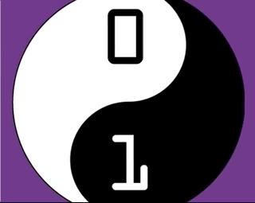
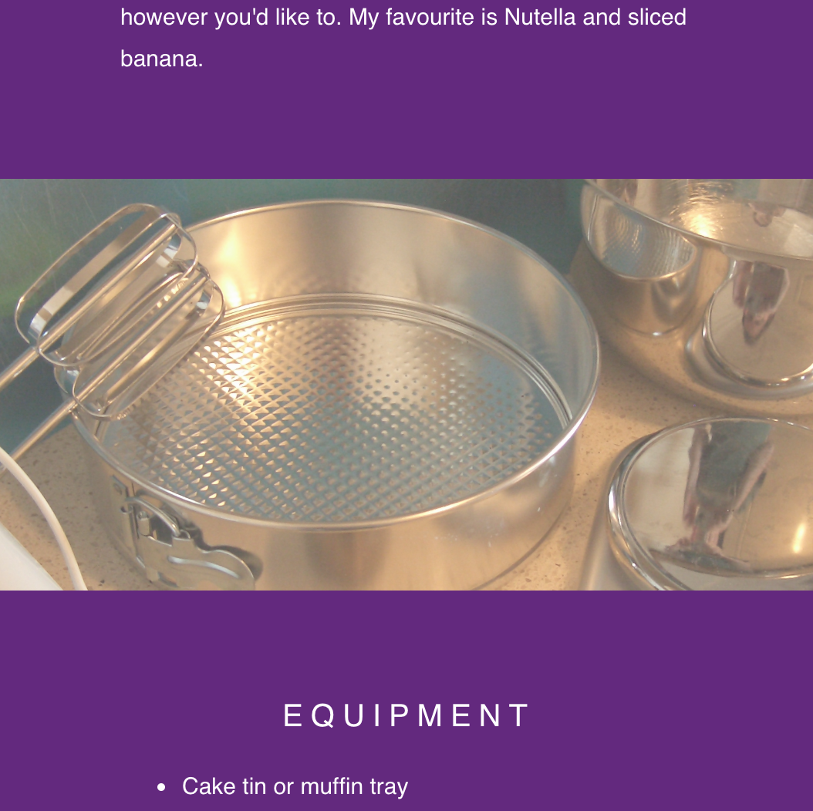

## Parallax scroll(लंबन स्क्रॉल) जोड़ें

लंबन स्क्रॉल(Parallax scrolling) तब होता है जब किसी वेब पृष्ठ(पेज) पर पृष्ठभूमि सामग्री अग्रगामी सामग्री के लिए एक अलग गति से चलती है। आप इस प्रभाव को नीचे देख सकते हैं।



अब आपके वेब पृष्ठ(पेज) पर लंबन(parallax) प्रभाव जोड़ने का समय है!

--- task ---

निम्नलिखित सीएसएस(CSS) नियम-सेट में, `background-attachment` संपत्ति(property) जोड़ें और इसे मूल्य दे `fixed` ।

```css
.cd-logo, .kitchen-equipment, .cake-ingredients{
  position: relative;
  background-position: center;
  background-repeat: no-repeat;
  background-color: #642580;
  background-size: cover;
  min-height: 100%;

  background-attachment: fixed;
}
```

--- /task ---

--- task ---

यदि आप पाठ अनुभागों(text sections) के बीच अंतर के माप को अनुकूलित करना चाहते हैं, तो `min-height` संपत्ति बदलें। विभिन्न आकारों के साथ प्रयोग करें और `0%` से `100%` के बीच एक मान चुनें।

--- /task ---

--- task ---

यदि आप `div` तत्वों( elements) को आर पार देखना चाहते हैं, तो CSS नियम-सेट(rule-set) की `opacity` संपत्ति(property) जोड़ें। `0.1` और `1` के बीच कुछ मान आज़माएँ ।

नीचे दी गई छवि, `opacity` संपत्ति(property) को `0.7` से स्थापित करने से हो रहे प्रभाव को दिखाती है।



--- /task ---

यदि आपके वेब पृष्ठ(पेज) पर आपका अंतिम भाग बहुत छोटा है, तो जब आप पृष्ठ के निचले भाग में सभी तरह से स्क्रॉल करते हैं, तो कुछ चित्र दिखाता है, तो उस अनुभाग के `min-height` को `100%` निर्धारित करने के लिए एक नया नियम-सेट जोड़ें  ।

यहां बताया गया है कि आपका नया नियम-सेट कैसा दिख सकता है:

```css
  .cd-logo, .kitchen-equipment {
  position: relative;
  background-position: center;
  background-repeat: no-repeat;
  background-color: #642580;
  background-size: cover;

  background-attachment: fixed;
  min-height: 50%;
  opacity: 0.7;
}
```
