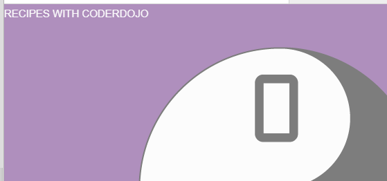

## शीर्षक(Caption) जोड़ें

इसके बाद, कुछ कैप्शन बॉक्स जोड़कर चित्र शीर्षकों को शामिल करें।


--- task ---

+ सबसे पहले, `cd-logo` div के **अंदर**एक`div` तत्व(element) जोड़ें। `div` क्लास को का नया नाम `caption` दे।

+ फिर एक `span` टैग उस पाठ के चारों ओर जोड़ें जिसे आप अपनी हेडिंग के रूप में चाहते हैं।

यह HTML कोड `div` में `cd-logo` क्लास नाम के साथ एक हेडिंग जोड़ता है:

```html
  <div class="cd-logo">
    <div class="caption">
      <span class="border" >RECIPES WITH CODERDOJO</span>
    </div>
  </div>
```

आपको शीर्ष लेख(heading text) बिना किसी स्टाइल के दिखना चाहिए।



--- /task ---

आगे, अपने नए तत्वों(elements) को स्टाइल करने के लिए कुछ CSS नियम जोड़ें।

--- task ---

नए `div` तत्व(element) के लिए, नियम-सेट(rule-set) `caption` जोड़ें।

```css
.caption {
  position: absolute;
  top: 40%;
  width: 100%;
  text-align: center;
}
```

--- /task ---

---task ---

नए `span` तत्व(element) के लिए, नियम-सेट(rule-set) `border` जोड़ें।

```css
.border {
  background-color: #41BAC1;
  color: White;
  padding: 18px;
  font-size: 25px;
  letter-spacing: 10px;
}
```

--- /task ---

